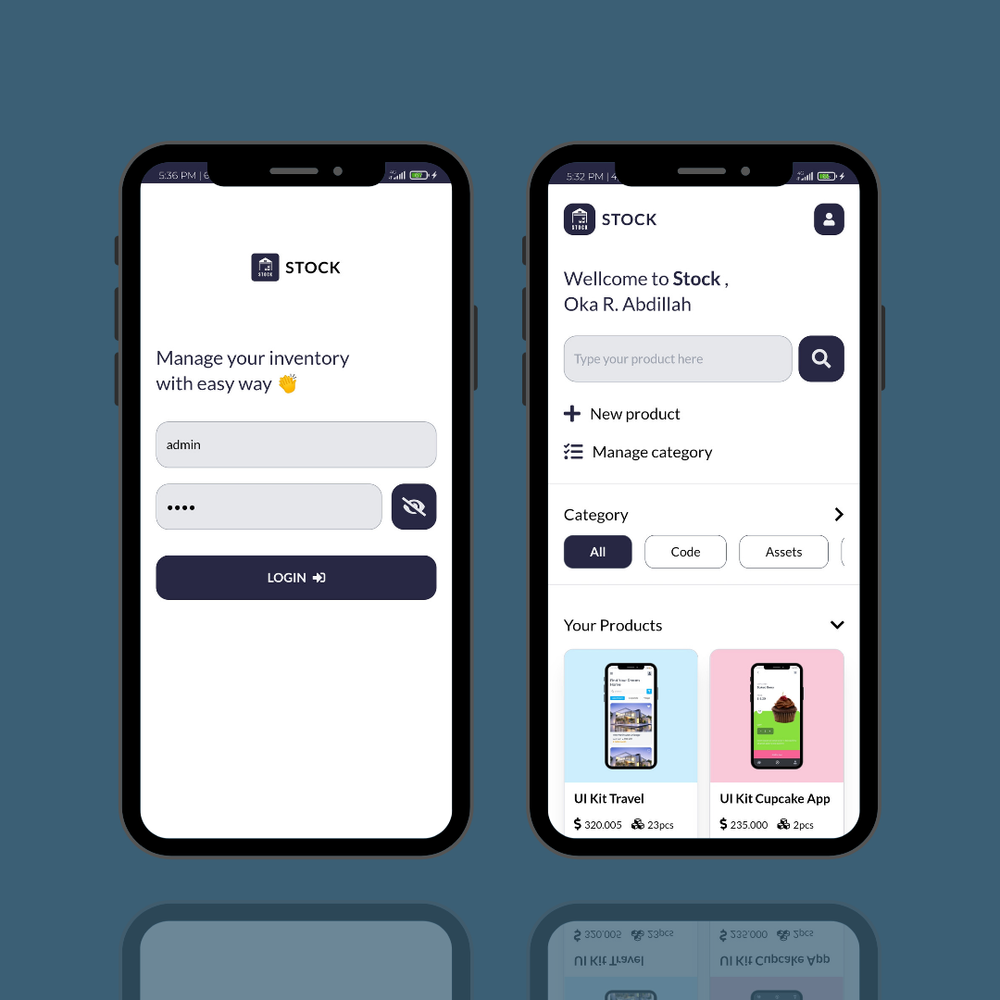
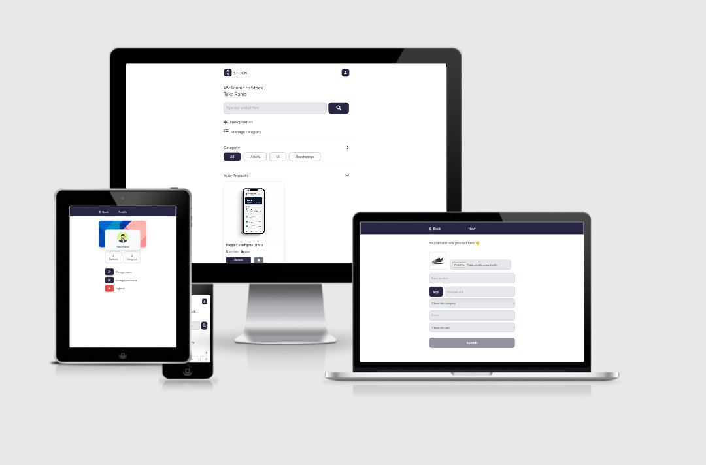

<h3 align="center">Stock APP</h3>

Manage Your Inventory With Easy Way

📌 Client Application / Front End

[More screenshoots](http://www.instagram.com/p/CVIPq2JlX2B/?utm_medium=copy_link)

### About
Stock App, is a website-based inventory management application built with Vue JS, Node JS, and MySql.
 
This application can assist users in managing their inventory in an easy and organized way with a categorization system and product search.

### Responsive Test

- Test Via [A'm I Responsive](http://ami.responsivedesign.is)

### Languages and Tools
- Vue JS 3
- Tailwindcss
- VUEX
- Vue Router
- Font Awesome 5
- Google Fonts
- Vite Js
- Termux
- Acode code editor
- Git
- Canva for wireframe and mockup

### Features
- Create new product
- Update product
- Remove product
- Upload image to server
- Remove image from server
- Create category
- Rename category
- Create new category
- Remove category
- Product search by keyword
- Product search by category
- Change name 
- Change password
- Login with username and password
- Minimalist design UI

### Demo 
- [Demo Stock App - Inventory Management](http://www.instagram.com/reel/CVMyBH1FOdB/?utm_medium=copy_link)

### How To Start
- Clone this repository with this command <code>git clone https://github.com/or-abdillh/stock-app.git</code>
- Then, use this command <code>cd stock-app</code>
- Install all dependencies <code>npm install</code>
- Finally run the server <code>npm run dev</code>
- The local server running at http://localhost:3000/
- By default username = admin and password = hans4x

### Thanks 
- Support me with a cup of coffee and other snacks [here ..](https://saweria.co/orabdillh)
- Don't forget to give me star in this repository 🙏🏻🙏🏻
- See my other projects on instagram [@or_abdillh](http://www.instagram.com/or_abdillh)

[Oka R Abdillah](http://github.com/or-abdillh)
 
Last edited on : 30/10/2021